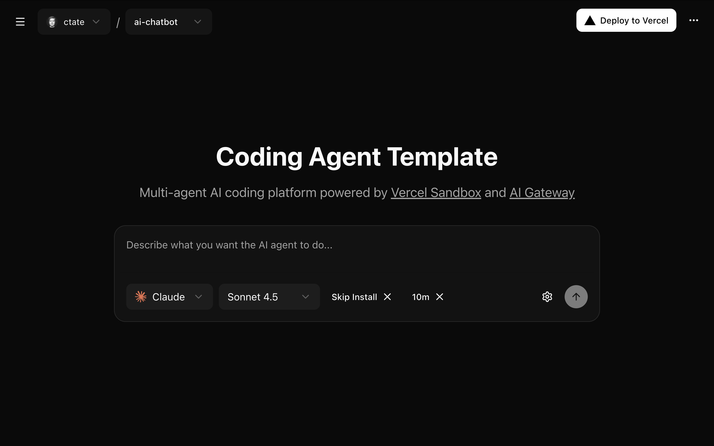

# Coding Agent Template

A template for building AI-powered coding agents that supports Claude Code, OpenAI's Codex CLI, Cursor CLI, Google Gemini CLI, and opencode with [Vercel Sandbox](https://vercel.com/docs/vercel-sandbox) to automatically execute coding tasks on your repositories.



## Changelog

### Version 2.0.0 - Major Update: User Authentication & Security

This release introduces **user authentication** and **major security improvements**, but contains **breaking changes** that require migration for existing deployments.

#### New Features

- **User Authentication System**
  - Sign in with Vercel
  - Sign in with GitHub
  - Session management with encrypted tokens
  - User profile management

- **Multi-User Support**
  - Each user has their own tasks and connectors
  - Users can manage their own API keys (Anthropic, OpenAI, Cursor, Gemini, AI Gateway)
  - GitHub account connection for repository access

- **Security Enhancements**
  - **CRITICAL FIX**: Removed shared `GITHUB_TOKEN` usage in API endpoints - now uses per-user GitHub tokens
  - All sensitive data (tokens, API keys, env vars) encrypted at rest
  - Session-based authentication with JWT encryption
  - User-scoped authorization - users can only access their own resources

- **Database Enhancements**
  - New `users` table for user profiles and OAuth accounts
  - New `accounts` table for linked accounts (e.g., Vercel users connecting GitHub)
  - New `keys` table for user-provided API keys
  - Foreign key relationships ensure data integrity
  - Soft delete support for tasks

#### Breaking Changes

**These changes require action if upgrading from v1.x:**

1. **Database Schema Changes**
   - `tasks` table now requires `userId` (foreign key to `users.id`)
   - `connectors` table now requires `userId` (foreign key to `users.id`)
   - `connectors.env` changed from `jsonb` to encrypted `text`
   - Added `tasks.deletedAt` for soft deletes

2. **API Changes**
   - All API endpoints now require authentication
   - Task creation requires `userId` in request body
   - Tasks are now filtered by user ownership
   - GitHub API access uses user's own GitHub token (no shared token fallback)

3. **Environment Variables**
   - **New Required Variables:**
     - `JWE_SECRET`: Base64-encoded secret for session encryption (generate: `openssl rand -base64 32`)
     - `ENCRYPTION_KEY`: 32-byte hex string for encrypting sensitive data (generate: `openssl rand -hex 32`)
     - `NEXT_PUBLIC_AUTH_PROVIDERS`: Configure which auth providers to enable (`github`, `vercel`, or both)
   
   - **New OAuth Configuration (at least one required):**
     - GitHub: `GITHUB_CLIENT_ID`, `GITHUB_CLIENT_SECRET`, `NEXT_PUBLIC_GITHUB_CLIENT_ID`
     - Vercel: `VERCEL_CLIENT_ID`, `VERCEL_CLIENT_SECRET`
   
   - **Removed Fallback:**
     - `GITHUB_TOKEN` no longer used as fallback in API routes (security fix)
     - Users must connect their own GitHub account for repository access

4. **Authentication Required**
   - All routes now require user authentication
   - No anonymous access to tasks or API endpoints
   - Users must sign in with GitHub or Vercel before creating tasks

#### Migration Guide for Existing Deployments

If you're upgrading from v1.x to v2.0.0, follow these steps:

##### Step 1: Backup Your Database

```bash
# Create a backup of your existing database
pg_dump $POSTGRES_URL > backup-before-v2-migration.sql
```

##### Step 2: Add Required Environment Variables

Add these new variables to your `.env.local` or Vercel project settings:

```bash
# Session encryption (REQUIRED)
JWE_SECRET=$(openssl rand -base64 32)
ENCRYPTION_KEY=$(openssl rand -hex 32)

# Configure auth providers (REQUIRED - choose at least one)
NEXT_PUBLIC_AUTH_PROVIDERS=github  # or "vercel" or "github,vercel"

# GitHub OAuth (if using GitHub authentication)
GITHUB_CLIENT_ID=your_github_client_id
GITHUB_CLIENT_SECRET=your_github_client_secret
NEXT_PUBLIC_GITHUB_CLIENT_ID=your_github_client_id

# Vercel OAuth (if using Vercel authentication)
VERCEL_CLIENT_ID=your_vercel_client_id
VERCEL_CLIENT_SECRET=your_vercel_client_secret
```

##### Step 3: Set Up OAuth Applications

Create OAuth applications for your chosen authentication provider(s). See the [Setup](#4-set-up-oauth-applications) section for detailed instructions.

##### Step 4: Prepare Database Migration

Before running migrations, you need to handle existing data:

**Option A: Fresh Start (Recommended for Development)**

If you don't have production data to preserve:

```bash
# Drop existing tables and start fresh
pnpm db:push --force

# This will create all new tables with proper structure
```

**Option B: Preserve Existing Data (Production)**

If you have existing tasks/connectors to preserve:

1. **Create a system user first:**

```sql
-- Connect to your database and run:
INSERT INTO users (id, provider, external_id, access_token, username, email, created_at, updated_at, last_login_at)
VALUES (
  'system-user-migration',
  'github',
  'system-migration',
  'encrypted-placeholder-token',  -- You'll need to encrypt a placeholder
  'System Migration User',
  NULL,
  NOW(),
  NOW(),
  NOW()
);
```

2. **Update existing records:**

```sql
-- Add userId to existing tasks
ALTER TABLE tasks ADD COLUMN user_id TEXT;
UPDATE tasks SET user_id = 'system-user-migration' WHERE user_id IS NULL;
ALTER TABLE tasks ALTER COLUMN user_id SET NOT NULL;
ALTER TABLE tasks ADD CONSTRAINT tasks_user_id_fkey FOREIGN KEY (user_id) REFERENCES users(id) ON DELETE CASCADE;

-- Add userId to existing connectors
ALTER TABLE connectors ADD COLUMN user_id TEXT;
UPDATE connectors SET user_id = 'system-user-migration' WHERE user_id IS NULL;
ALTER TABLE connectors ALTER COLUMN user_id SET NOT NULL;
ALTER TABLE connectors ADD CONSTRAINT connectors_user_id_fkey FOREIGN KEY (user_id) REFERENCES users(id) ON DELETE CASCADE;

-- Convert connector env from jsonb to encrypted text (requires app-level encryption)
-- Note: You'll need to manually encrypt existing env values using your ENCRYPTION_KEY
```

3. **Run the standard migrations:**

```bash
pnpm db:generate
pnpm db:push
```

##### Step 5: Update Your Code

Pull the latest changes:

```bash
git pull origin main
pnpm install
```

##### Step 6: Test Authentication

1. Start the development server: `pnpm dev`
2. Navigate to `http://localhost:3000`
3. Sign in with your configured OAuth provider
4. Verify you can create and view tasks

##### Step 7: Verify Security Fix

Confirm that:
- Users can only see their own tasks
- File diff/files endpoints require GitHub connection
- Users without GitHub connection see "GitHub authentication required" errors
- No `GITHUB_TOKEN` fallback is being used in API routes

#### Important Notes

- **All users will need to sign in** after this upgrade - no anonymous access
- **Existing tasks** will be owned by the system user if using Option B migration
- **Users must connect GitHub** (if they signed in with Vercel) to access repositories
- **API keys** can now be per-user - users can override global API keys in their profile
- **Breaking API changes**: If you have external integrations calling your API, they'll need to be updated to include authentication

#### Security Improvements

This release fixes a **critical authorization bypass vulnerability** where users could access any repository the shared `GITHUB_TOKEN` had access to. Now:

- Each user uses their own GitHub token
- Users can only access repositories they have permission for
- Proper authorization enforced at the GitHub API level
- No shared credentials that could be exploited

## Deploy Your Own

You can deploy your own version of the coding agent template to Vercel with one click:

[](https://vercel.com/new/clone?repository-url=https%3A%2F%2Fgithub.com%2Fvercel-labs%2Fcoding-agent-template&env=POSTGRES_URL,VERCEL_TOKEN,VERCEL_TEAM_ID,VERCEL_PROJECT_ID,JWE_SECRET,ENCRYPTION_KEY&envDescription=Required+infrastructure+environment+variables.+You+will+also+need+to+configure+OAuth+(Vercel+or+GitHub)+for+user+authentication.+Optional+API+keys+can+be+added+later.&project-name=coding-agent-template&repository-name=coding-agent-template)

## Features

- **Multi-Agent Support**: Choose from Claude Code, OpenAI Codex CLI, Cursor CLI, Google Gemini CLI, or opencode to execute coding tasks
- **Vercel Sandbox**: Runs code in isolated, secure sandboxes ([docs](https://vercel.com/docs/vercel-sandbox))
- **AI Gateway Integration**: Built for seamless integration with [Vercel AI Gateway](https://vercel.com/docs/ai-gateway) for model routing and observability
- **AI-Generated Branch Names**: Automatically generates descriptive Git branch names using AI SDK 5 + AI Gateway
- **Task Management**: Track task progress with real-time updates
- **Persistent Storage**: Tasks stored in Neon Postgres database
- **Git Integration**: Automatically creates branches and commits changes
- **Modern UI**: Clean, responsive interface built with Next.js and Tailwind CSS
- **MCP Server Support**: Connect MCP servers to Claude Code for extended capabilities (Claude only)

## Setup

### 1. Clone the repository

```bash
git clone https://github.com/vercel-labs/coding-agent-template.git
cd coding-agent-template
```

### 2. Install dependencies

```bash
pnpm install
```

### 3. Set up environment variables

Create a `.env.local` file with your values:

#### Required Environment Variables (App Infrastructure)

These are set once by you (the app developer) and are used for core infrastructure:

- `POSTGRES_URL`: Your PostgreSQL connection string (works with any PostgreSQL database)
- `VERCEL_TOKEN`: Your Vercel API token (for creating sandboxes)
- `VERCEL_TEAM_ID`: Your Vercel team ID (for sandbox creation)
- `VERCEL_PROJECT_ID`: Your Vercel project ID (for sandbox creation)
- `JWE_SECRET`: Base64-encoded secret for session encryption (generate with: `openssl rand -base64 32`)
- `ENCRYPTION_KEY`: 32-byte hex string for encrypting user API keys and tokens (generate with: `openssl rand -hex 32`)

#### User Authentication (Required)

**You must configure at least one authentication method** (Vercel or GitHub):

##### Configure Enabled Providers

- `NEXT_PUBLIC_AUTH_PROVIDERS`: Comma-separated list of enabled auth providers
  - `"github"` - GitHub only (default)
  - `"vercel"` - Vercel only
  - `"github,vercel"` - Both providers enabled

**Examples:**

```bash
# GitHub authentication only (default)
NEXT_PUBLIC_AUTH_PROVIDERS=github

# Vercel authentication only
NEXT_PUBLIC_AUTH_PROVIDERS=vercel

# Both GitHub and Vercel authentication
NEXT_PUBLIC_AUTH_PROVIDERS=github,vercel
```

##### Provider Configuration

**Option 1: Sign in with Vercel** (if `vercel` is in `NEXT_PUBLIC_AUTH_PROVIDERS`)
- `VERCEL_CLIENT_ID`: Your Vercel OAuth app client ID
- `VERCEL_CLIENT_SECRET`: Your Vercel OAuth app client secret

**Option 2: Sign in with GitHub** (if `github` is in `NEXT_PUBLIC_AUTH_PROVIDERS`)
- `GITHUB_CLIENT_ID`: Your GitHub OAuth app client ID
- `GITHUB_CLIENT_SECRET`: Your GitHub OAuth app client secret
- `NEXT_PUBLIC_GITHUB_CLIENT_ID`: Your GitHub OAuth app client ID (same as above, exposed to client)

> **Note**: Only the providers listed in `NEXT_PUBLIC_AUTH_PROVIDERS` will appear in the sign-in dialog. You must provide the OAuth credentials for each enabled provider.

#### API Keys (Optional - Can be per-user)

These API keys can be set globally (fallback for all users) or left unset to require users to provide their own:

- `ANTHROPIC_API_KEY`: Anthropic API key for Claude agent (users can override in their profile)
- `AI_GATEWAY_API_KEY`: AI Gateway API key for branch name generation and Codex (users can override)
- `CURSOR_API_KEY`: For Cursor agent support (users can override)
- `GEMINI_API_KEY`: For Google Gemini agent support (users can override)
- `OPENAI_API_KEY`: For Codex and OpenCode agents (users can override)

> **Note**: Users can provide their own API keys in their profile settings, which take precedence over global environment variables.

#### GitHub Repository Access

- ~~`GITHUB_TOKEN`~~: **No longer needed!** Users authenticate with their own GitHub accounts.
  - Users who sign in with GitHub automatically get repository access via their OAuth token
  - Users who sign in with Vercel can connect their GitHub account from their profile to access repositories

**How Authentication Works:**
- **Sign in with GitHub**: Users get immediate repository access via their GitHub OAuth token
- **Sign in with Vercel**: Users must connect a GitHub account from their profile to work with repositories
- **Identity Merging**: If a user signs in with Vercel, connects GitHub, then later signs in directly with GitHub, they'll be recognized as the same user (no duplicate accounts)

#### Optional Environment Variables

- `NPM_TOKEN`: For private npm packages
- `GITHUB_TOKEN`: Only needed if you want to provide fallback repository access for Vercel users who haven't connected GitHub

### 4. Set up OAuth Applications

Based on your `NEXT_PUBLIC_AUTH_PROVIDERS` configuration, you'll need to create OAuth apps:

#### GitHub OAuth App (if using GitHub authentication)

1. Go to [GitHub Developer Settings](https://github.com/settings/developers)
2. Click "New OAuth App"
3. Fill in the details:
   - **Application name**: Your app name (e.g., "My Coding Agent")
   - **Homepage URL**: `http://localhost:3000` (or your production URL)
   - **Authorization callback URL**: `http://localhost:3000/api/auth/github/callback`
4. Click "Register application"
5. Copy the **Client ID** → use for both `GITHUB_CLIENT_ID` and `NEXT_PUBLIC_GITHUB_CLIENT_ID`
6. Click "Generate a new client secret" → copy and use for `GITHUB_CLIENT_SECRET`

**Required Scopes**: The app will request `repo` scope to access repositories.

#### Vercel OAuth App (if using Vercel authentication)

1. Go to your [Vercel Dashboard](https://vercel.com/dashboard)
2. Navigate to Settings → Integrations → Create
3. Configure the integration:
   - **Redirect URL**: `http://localhost:3000/api/auth/callback/vercel`
4. Copy the **Client ID** → use for `VERCEL_CLIENT_ID`
5. Copy the **Client Secret** → use for `VERCEL_CLIENT_SECRET`

> **Production Deployment**: Remember to add production callback URLs when deploying (e.g., `https://yourdomain.com/api/auth/github/callback`)

### 5. Set up the database

Generate and run database migrations:

```bash
pnpm db:generate
pnpm db:push
```

### 6. Start the development server

```bash
pnpm dev
```

Open [http://localhost:3000](http://localhost:3000) in your browser.

## Usage

1. **Create a Task**: Enter a repository URL and describe what you want the AI to do
2. **Monitor Progress**: Watch real-time logs as the agent works
3. **Review Results**: See the changes made and the branch created
4. **Manage Tasks**: View all your tasks in the sidebar with status updates

## How It Works

1. **Task Creation**: When you submit a task, it's stored in the database
2. **AI Branch Name Generation**: AI SDK 5 + AI Gateway automatically generates a descriptive branch name based on your task (non-blocking using Next.js 15's `after()`)
3. **Sandbox Setup**: A Vercel sandbox is created with your repository
4. **Agent Execution**: Your chosen coding agent (Claude Code, Codex CLI, Cursor CLI, Gemini CLI, or opencode) analyzes your prompt and makes changes
5. **Git Operations**: Changes are committed and pushed to the AI-generated branch
6. **Cleanup**: The sandbox is shut down to free resources

## Environment Variables

See the [Set up environment variables](#3-set-up-environment-variables) section above for a complete guide.

**Key Points:**
- **Infrastructure**: Set `POSTGRES_URL`, `VERCEL_TOKEN`, `VERCEL_TEAM_ID`, `VERCEL_PROJECT_ID`, `JWE_SECRET`, and `ENCRYPTION_KEY` as the app developer
- **Authentication**: Configure at least one OAuth method (Vercel or GitHub) for user sign-in
- **API Keys**: Can be set globally or left for users to provide their own (per-user keys take precedence)
- **GitHub Access**: Users authenticate with their own GitHub accounts - no shared `GITHUB_TOKEN` needed!

## AI Branch Name Generation

The system automatically generates descriptive Git branch names using AI SDK 5 and Vercel AI Gateway. This feature:

- **Non-blocking**: Uses Next.js 15's `after()` function to generate names without delaying task creation
- **Descriptive**: Creates meaningful branch names like `feature/user-authentication-A1b2C3` or `fix/memory-leak-parser-X9y8Z7`
- **Conflict-free**: Adds a 6-character alphanumeric hash to prevent naming conflicts
- **Fallback**: Gracefully falls back to timestamp-based names if AI generation fails
- **Context-aware**: Uses task description, repository name, and agent context for better names

### Branch Name Examples

- `feature/add-user-auth-K3mP9n` (for "Add user authentication with JWT")
- `fix/resolve-memory-leak-B7xQ2w` (for "Fix memory leak in image processing")
- `chore/update-deps-M4nR8s` (for "Update all project dependencies")
- `docs/api-endpoints-F9tL5v` (for "Document REST API endpoints")

## Tech Stack

- **Frontend**: Next.js 15, React 19, Tailwind CSS
- **UI Components**: shadcn/ui
- **Database**: PostgreSQL with Drizzle ORM
- **AI SDK**: AI SDK 5 with Vercel AI Gateway integration
- **AI Agents**: Claude Code, OpenAI Codex CLI, Cursor CLI, Google Gemini CLI, opencode
- **Sandbox**: [Vercel Sandbox](https://vercel.com/docs/vercel-sandbox)
- **Git**: Automated branching and commits with AI-generated branch names

## MCP Server Support

Connect MCP Servers to extend Claude Code with additional tools and integrations. **Currently only works with Claude Code agent.**

### How to Add MCP Servers

1. Go to the "Connectors" tab and click "Add MCP Server"
2. Enter server details (name, base URL, optional OAuth credentials)
3. If using OAuth, generate encryption key: `openssl rand -hex 32`
4. Add to `.env.local`: `ENCRYPTION_KEY=your-32-byte-hex-key`

**Note**: `ENCRYPTION_KEY` is only required when using MCP servers with OAuth authentication.

## Development

### Database Operations

```bash
# Generate migrations
pnpm db:generate

# Push schema changes
pnpm db:push

# Open Drizzle Studio
pnpm db:studio
```

### Running the App

```bash
# Development
pnpm dev

# Build for production
pnpm build

# Start production server
pnpm start
```

## Contributing

1. Fork the repository
2. Create a feature branch
3. Make your changes
4. Test thoroughly
5. Submit a pull request

## Security Considerations

- **Environment Variables**: Never commit `.env` files to version control. All sensitive data should be stored in environment variables.
- **API Keys**: Rotate your API keys regularly and use the principle of least privilege.
- **Database Access**: Ensure your PostgreSQL database is properly secured with strong credentials.
- **Vercel Sandbox**: Sandboxes are isolated but ensure you're not exposing sensitive data in logs or outputs.
- **GitHub Token**: Use a personal access token with minimal required permissions for repository access.
